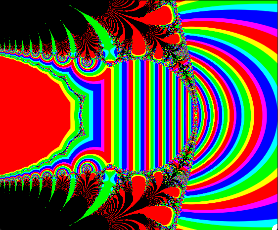
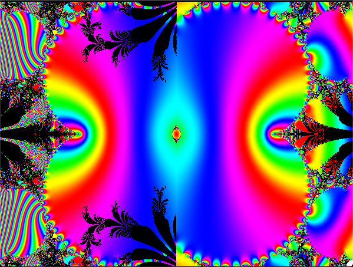
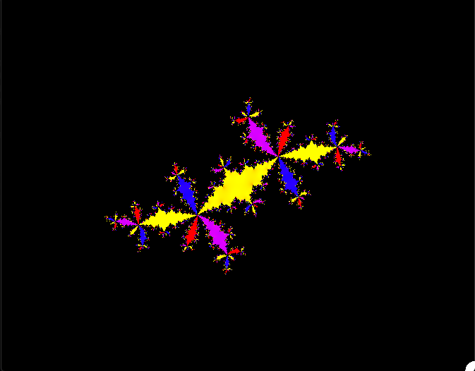

# Basic Template for OpenGL projects on MacOS

Build: `make` 

Run: 

```bash
./game -l #lambert W function 
```


```bash
./game -p #power tower fractal 
```


```bash
./game -l #Julia Set 
```


